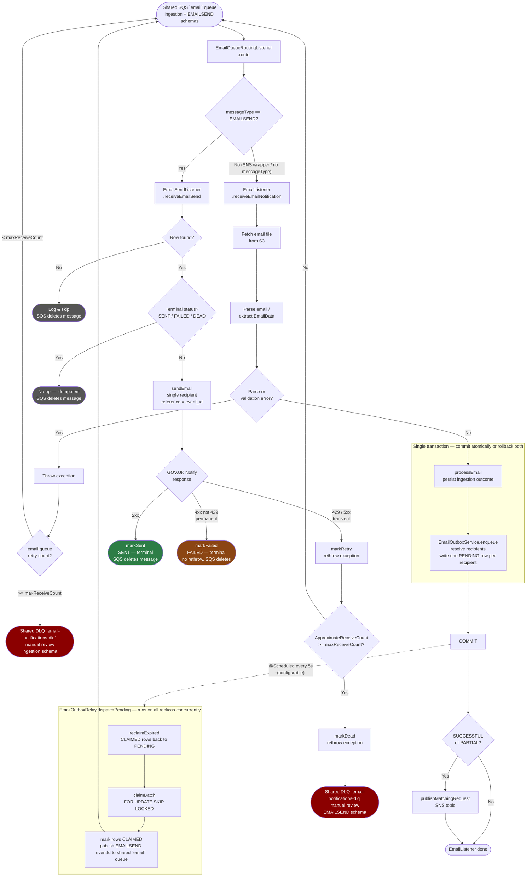
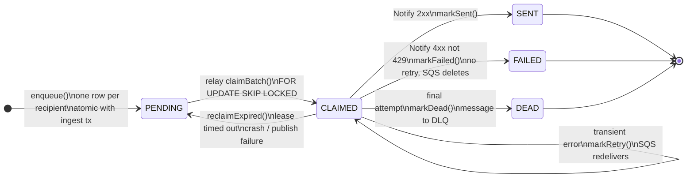

# Email Outbox: Flow Diagrams

## End-to-End Flow (Happy & Sad Paths)

---

## `email_outbox` Row State Machine

---

## Behavior per partial-failure scenario

| Scenario | What happens |
|---|---|
| All recipients succeed | Each recipient's row → `SENT` independently |
| All fail (transient) | Each row retries independently; on final attempt → `DEAD` + DLQ |
| All fail (Notify 4xx) | Each row → `FAILED` immediately; no retry storm |
| **Some succeed, some fail** | Succeeded rows stay `SENT` (terminal no-op on redelivery); only failed rows retry — **no duplicate emails** |
| Relay crash mid-batch | Leased rows reclaimed to `PENDING` after `leaseTimeout` |
| SQS redelivery of a `SENT` row | Terminal-status guard no-ops; submission contract is at-least-once, and Notify `reference = event_id` dedupes at provider (https://docs.notifications.service.gov.uk/java.html#reference-required) |
| DLQ replay | Shared `email-notifications-dlq` holds both schemas; inspect payload type first, then replay accordingly. Outbox replay stays safe via idempotent worker + `event_id` correlation |

See [email-outbox-testing.md](email-outbox-testing.md) for how to test each path.

