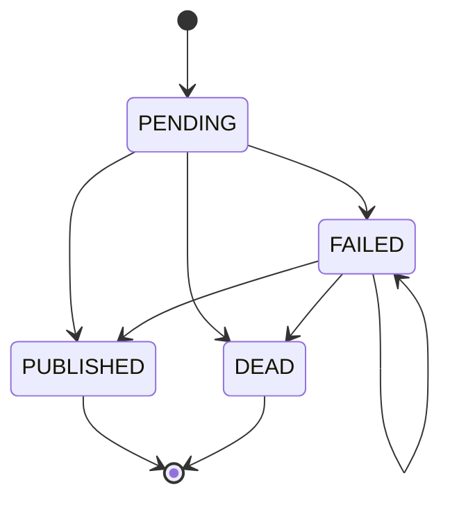

# Outboxes

## What exists

This service has two transactional outboxes:

| Outbox | Created when | Payload | Sent to |
| --- | --- | --- | --- |
| `publish_matching_outbox` | `CrimeBatchEmailIngestionService.persistIngestion()` for `SUCCESSFUL` and `PARTIAL` ingestions | `MatchingNotification` | SNS topic `matchingnotificationstopic` |
| `email_outbox` | `CrimeBatchEmailIngestionService.persistIngestion()` when `notify.enabled=true` | `NotifyEmailRequest` | GOV.UK Notify |

Both outbox rows are written in the same transaction as the ingestion data, so we do not lose the intent to publish if SNS or Notify is down at commit time.

## How it works

1. `EmailListener` processes the inbound S3 notification.
2. `CrimeBatchEmailIngestionService.persistIngestion()` saves the ingestion result and any required outbox rows in one transaction.
3. `EmailListener` then makes an immediate best-effort call to:
   - `MatchingNotificationService.publishMatchingRequests()`
   - `EmailNotificationService.sendEmails()`
4. `OutboxScheduler` retries both flows every 15 minutes if anything is still pending.
5. Each outbox repository claims small batches with `FOR UPDATE SKIP LOCKED`, and completion uses the row `version` to avoid double-completing work across replicas.

`claimed_at` acts as a short lease. Rows can be reclaimed once the claim is older than 60 seconds.

## State model

Both tables use the same states:

- `PENDING`: ready to be claimed
- `FAILED`: attempt failed, will be retried while `attempts < 3`
- `PUBLISHED`: handoff succeeded
- `DEAD`: terminal failure, no more retries



Claiming is tracked by `claimed_at`, not by a separate persisted state. A row is claimed while still stored as `PENDING` or `FAILED`, then completed as `PUBLISHED`, `FAILED`, or `DEAD`.

Email-specific behaviour differs slightly from matching:

- Notify **non-transient 4xx** failures go straight to `DEAD`
- other Notify failures go `FAILED` and are retried
- matching publish failures go `FAILED`, then `DEAD` after the third failed attempt

## Design decisions

- **Transactional outbox instead of inline-only network calls**: ingestion can commit even if Notify or SNS is temporarily unavailable.
- **Immediate first attempt plus scheduled retries**: keeps the happy path fast, while still giving us recovery if the process crashes after commit.
- **`FOR UPDATE SKIP LOCKED` + optimistic completion**: simple concurrency control that works across multiple replicas without leader election.
- **At-least-once delivery**: simpler and more robust than trying to guarantee exactly-once across DB + external systems; duplicates are possible if we fail after the external call but before updating the row.
  - Note that Gov Notify is not an idempotent consumer, so sent emails could be duplicated.

## Local testing

`application-local.yml` has `notify.enabled: false`, so enable it when you want to exercise `email_outbox`.

### 1. Start local dependencies

```bash
docker compose up -d db localstack wiremock
./scripts/wiremock-notify-mode.sh <201|400|500|500-then-201>
```

### 2. Run the API

### 3. Ingest sample emails

```bash
./scripts/localstack-ingest-sample-emails.sh
```
### 4. Check the outbox tables

```bash
docker exec -it query-db psql -U postgres -d postgres -c "select payload, state, attempts, last_error, claimed_at from publish_matching_outbox;" 
docker exec -it query-db psql -U postgres -d postgres -c "select payload, state, attempts, last_error, claimed_at from email_outbox;" 
```

That script uploads every `.eml` file in `scripts/fixtures/`, sends the matching SQS messages, and **truncates application tables first** so each run starts clean.


